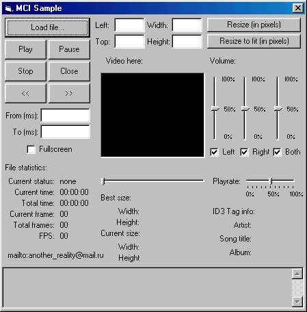



## MCI Api class

### Description

This code wraps API Functions, that manipulate MCI Devices (mciSendString, mciGetErrorString).
 
### More Info
 
Just declare class and use it's methods to control your multimedia

All explanations are at the top of the class

It returns errors and errors description

none, I think

             |
---                |---
**Submitted On**   |2001-10-12 12:33:40
**By**             |[Talen](https://github.com/Planet-Source-Code/PSCIndex/blob/master/ByAuthor/talen.md)
**Level**          |Intermediate
**User Rating**    |4.3 (13 globes from 3 users)
**Compatibility**  |VB 5\.0, VB 6\.0
**Category**       |[Windows API Call/ Explanation](https://github.com/Planet-Source-Code/PSCIndex/blob/master/ByCategory/windows-api-call-explanation__1-39.md)
**World**          |[Visual Basic](https://github.com/Planet-Source-Code/PSCIndex/blob/master/ByWorld/visual-basic.md)
**Archive File**   |[MCI Api cl2867310122001\.zip](https://github.com/Planet-Source-Code/talen-mci-api-class__1-28014/archive/master.zip)

